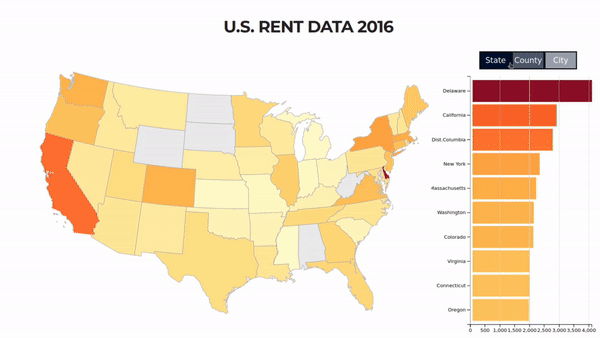

# US Rent Data 2016
Interactive D3 map visualization of US rent data in 2016.

## Site Link:
https://seantey.github.io/rent-usa-d3/

## Data Source

The data used in the visualization above is from the zillow research website. The specific data set used is the Neighborhood category, ZRI Time Series: Multifamily, SFR, Condo/Co-op ($) which takes into account of all home and apartment types.

## Original Data

The original data for prices are based on the Zillow Rent Index(ZRI). According to the Zillow Research website, the are 3 main steps involved in constructing the ZRI—Calculate Raw Median Rent Zestimates, Apply Simple 3-Month Moving Average, and Final Quality Control.

The ZRI is calculated using Zillow's proprietary statistical and machine learning models. Within each county or state, the models observe recent rental listings and learn the relative contribution of various home attributes in predicting prevailing rents. These home attributes include physical facts about the home, prior sale transactions, tax assessment information and geographic location as well as the estimated market value of the home. For more info, go to the Zillow page on methodology.

## Processing the data

In it's original form, the data was in wide format, instead of the usual time-series long format. R was used to reshape the data to long format for easier visualizing. The data was also further processed by filtering out only continental US data and sorting was done for convenience.

Because the Zillow Website did not have a dataset aggregated on City Price and due to licensing terms that requires the data to be in a derivative form, the neighborhood data was aggregated by simply taking the average on the ZRI prices.

The data was divided into 3 files—state,county, and city—by aggregating neighborhood prices to the specified categories. The R-package "ggmap" was also used to iteratively download latitude and logitude data for each city from the google map api.

[Click to view R Script used.](https://seantey.github.io/rent-usa-d3/zillowR.txt)